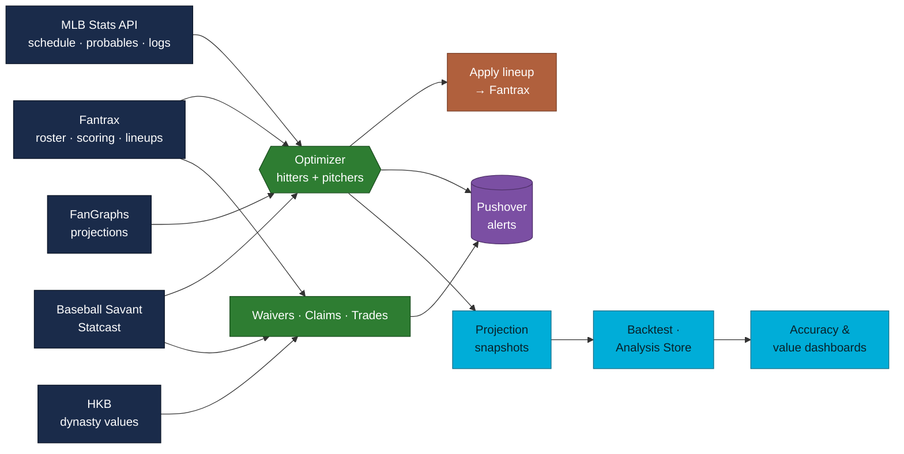

<div align="center">

# ⚾ RosterBot

**An autonomous manager for Fantrax head-to-head points leagues.**
It sets the lineup every hour, works the waiver wire, watches the league, and grades its own decisions — no human at the keyboard.


</div>

---

RosterBot is a single Go binary of Cobra subcommands that pulls from five live data feeds, makes a lineup decision, and writes it straight back to Fantrax — then keeps a running record of how good that decision turned out to be. It runs unattended on AWS, but every command works locally in a read-only `--dry-run` mode so you can watch it think before it touches a roster.

## How it thinks



**Statcast picks _who_ surfaces on the wire; FanGraphs scores _how much_ each player is worth under this league's own scoring weights.** That separation runs through the whole codebase — the optimizer never guesses at value it can compute.

## What it does

- **Sets the daily lineup** — A backtracking optimizer finds the globally optimal hitter slot assignment; a separate pitcher optimizer respects probable starters and the weekly games-started budget. Projections blend FanGraphs with recent rolling stats, so hot and cold streaks move the needle.
- **Reads the real box score** — Checks actual MLB starting lineups, so a player getting a rest day is benched in favor of someone actually in the order.
- **Works the waiver wire** — Cross-references free agents against Baseball Savant to surface **buy-low** candidates (expected stats outpacing surface stats) and **hot** streaks (recent production backed by barrel and hard-hit quality), ranked by projected fantasy points.
- **Recaps the wire** — A league-wide daily recap of processed CLAIM/DROP moves, valued by HKB dynasty rankings, with a per-team leaderboard, a notable-drops watch, and Statcast tags on every pickup. Writes an audit ledger and uses a cursor to never alert twice.
- **Monitors prospects** — Scans MLB transactions, MiLB breakouts, and prospect boards (MLB Pipeline → FanGraphs) for call-up alerts, hot streaks, and upgrade recommendations.
- **Watches the league** — Trade monitor (valued by HKB), roster-hygiene alerts (players stuck in the wrong slot), and a league-wide games-started violation checker.
- **Grades the tape** — Backtests past lineups against the hindsight-optimal lineup, and grades every projection against the fantasy points that actually scored — sliced by position and by projection system.
- **Tells the story** — Sleeper-style weekly HTML recaps with a Game-of-the-Week win-probability chart, League Leaders board, and comeback/lead-change awards.
- **Publishes dashboards** — A daily projection-accuracy dashboard (scorecard, trend, per-position MAE, calibration, worst misses, model comparison) and a per-team dynasty-value tracker, both served as a private SPA behind a passkey.

---

## Quick start

**Prerequisites:** Go 1.26+ and Chrome (headless, for Fantrax's browser-based auth).

**1 — Configure.** Create a gitignored `.env`:

```dotenv
FANTRAX_USERNAME=your_username
FANTRAX_PASSWORD=your_password
FANTRAX_LEAGUE_ID=your_league_id
FANTRAX_TEAM_ID=your_team_id
FANTRAX_IL_SLOTS=3
FANTRAX_MINORS_SLOTS=5
```

**2 — Build.**

```bash
make build      # produces ./rosterbot
make install    # installs to $GOPATH/bin
```

**3 — Watch it work (read-only).**

```bash
rosterbot optimize --dry-run          # today's optimal lineup, applies nothing
rosterbot waivers  --dry-run          # Statcast-driven free-agent picks
rosterbot scoring                     # print the league's scoring weights
```

> [!TIP]
> Every command that changes state supports `--dry-run`. Drop the flag to apply for real. `make run-all` sweeps every command in dry-run / read-only mode — the fastest end-to-end sanity check.

---

## Command reference

The manager's day, grouped by job. Each group folds open.

<details>
<summary><b>Set the lineup</b> — <code>optimize</code></summary>

```bash
# Today (dry run)
rosterbot optimize --dry-run

# A specific date, or a date range
rosterbot optimize --dry-run --dates 2026-04-01
rosterbot optimize --dry-run --dates 2026-03-26:2026-03-28

# All remaining days in the current matchup period (what the hourly job runs)
rosterbot optimize --dry-run --matchup

# Show the full hitter adjustment pipeline: base → blend → park → platoon → opp SP → final
rosterbot optimize --dry-run --pipeline

# Swap projection system (default: depthcharts; in-season: depthcharts-ros)
#   steamer · depthcharts · thebatx · atc  (+ each system's -ros rest-of-season variant)
rosterbot optimize --dry-run --projections atc
rosterbot optimize --dry-run --projections steamer-ros

# Force fresh data (bypass every cache layer)
rosterbot optimize --dry-run --no-cache

# Archive today's projections so a later backtest can grade them exactly
rosterbot optimize --dry-run --snapshot
```

Remove `--dry-run` to apply. The optimizer is idempotent: a second run with the same inputs reports "No changes needed."

</details>

<details>
<summary><b>Work the wire</b> — <code>waivers</code> · <code>claims</code> · <code>prospects</code> · <code>transactions</code></summary>

```bash
# Statcast-driven free-agent picks (buy-low + confirmed hot streaks)
rosterbot waivers --dry-run
rosterbot waivers --dry-run --top 25              # bigger list
rosterbot waivers --dry-run --positions OF,SP     # filter to slots

# Daily recap of processed CLAIM/DROP moves, valued by HKB
rosterbot claims --dry-run
rosterbot claims --dry-run --no-signals           # skip Statcast enrichment
rosterbot claims --dry-run --drops-min 3000       # only flag drops above an HKB value
rosterbot claims --dry-run --since 2026-06-01     # one-off historical recap

# Prospect report (call-ups, MiLB breakouts, ranking upgrades)
rosterbot prospects --dry-run

# Recent league trades, each side valued by HKB
rosterbot transactions --dry-run
```

</details>

<details>
<summary><b>Mind the rules</b> — <code>gs-check</code> · <code>scoring</code></summary>

```bash
# League-wide games-started violation check (most recently completed period)
rosterbot gs-check --dry-run

# Print the league's stat → fantasy-point weights
rosterbot scoring
```

`gs-check` needs `GS_TRACKING_ENABLED=true` plus Pushover credentials; it's a clean no-op when tracking is off.

</details>

<details>
<summary><b>Grade the tape</b> — <code>backtest</code> · <code>shadow</code> · <code>grade</code></summary>

```bash
# Grade last completed matchup week: lineup Gap + projection accuracy
rosterbot backtest
rosterbot backtest --dates 2026-04-13:2026-04-19
rosterbot backtest --skip-projections               # lineup-only, faster

# Compare recency-weighting strategies (YTD vs 14d/30d/decay) by lineup Gap
rosterbot backtest --recency-experiment --dates 2026-05-01:2026-05-14

# Capture every projection system's lineup projections (read-only) for model comparison.
# Runs the optimize pipeline once per RoS system in dry-run; the next day's `grade` scores it.
rosterbot shadow
rosterbot shadow --dates 2026-06-30

# Materialize projected-vs-actual rows into the Analysis Store (feeds the dashboard + Athena)
rosterbot grade
```

</details>

<details>
<summary><b>Tell the story</b> — <code>recap</code> · <code>recap-site</code></summary>

```bash
# Sleeper-style HTML recap of the most recently completed matchup week
rosterbot recap --out /tmp/recap.html
rosterbot recap --dates 2026-04-20:2026-04-26 --out /tmp/recap.html
rosterbot recap --out /tmp/recap.html --open        # render + open in browser

# Build the multi-week static site (one HTML per completed week + index.html)
rosterbot recap-site --out dist
```

</details>

<details>
<summary><b>Keep the books</b> — <code>archive</code> · <code>team-values</code> · <code>projection-site</code></summary>

```bash
# Durable daily snapshot of ephemeral upstream data (HKB, projections, Savant, prospects)
rosterbot archive --dry-run                         # fetch + print sizes, write nothing
rosterbot archive --date 2026-06-30

# Append today's per-team aggregate HKB dynasty value to the Team Value Store
# (broken out hitter/pitcher × MLB/minors; the series accumulates forward, one point per day)
rosterbot team-values --dry-run
rosterbot team-values --date 2026-07-12

# Render dashboard data from the stores: writes <out>/model.json (accuracy) + <out>/value.json (dynasty value).
# The dashboard SPA fetches both and renders them client-side — projection-site writes no HTML.
rosterbot projection-site --out report
rosterbot projection-site --out report --open
```

</details>

<details>
<summary><b>Serve</b> — <code>serve</code> (read-only lineup API + web dashboard)</summary>

```bash
# Publish today's lineup JSON without touching your roster, then serve it
rosterbot optimize --dry-run --publish-lineup       # writes .lineup/lineup-today.json
ROSTERBOT_API_TOKEN=test ROSTERBOT_SESSION_SECRET=test-secret rosterbot serve
open http://localhost:8080/                          # dashboard bootstrap screen
```

See [Lineup API & dashboard](#lineup-api--dashboard) below for the full contract.

</details>

> [!NOTE]
> A handful of internal plumbing commands (`run-ledger`, `migrate-run-ledger`, `sync-up`, `sync-down`) are invoked by `entrypoint.sh` on AWS and aren't meant for interactive use.

---

## How the optimizer works

### Hitters

Backtracking with pruning finds the slot assignment that maximizes total expected points, respecting position eligibility (`C · 1B · 2B · 3B · SS · INF · OF · UT`) and preferring fewer roster moves when assignments tie. A player whose team isn't playing, who's confirmed out of the real MLB lineup, or who's injured / in the minors contributes 0 points and gets benched.

### Pitchers

Pitchers are scored off probable-starter data. A confirmed SP start gets full value; an SP not listed as probable gets a `0.10×` discount so relievers are preferred for scarce P slots. With `GS_TRACKING_ENABLED=true`, a games-started budget gate fetches the real GS limit live from Fantrax's own per-period config (which scales it whenever a period spans more than one calendar week, e.g. the All-Star break) and keeps only the highest-value starts across the matchup period.

### Projection blending

Projections blend FanGraphs season numbers with recent Fantrax scoring, weighted **dynamically** by sample size. The recent signal is a **trailing 30-day window** for hitters and **season-to-date** for pitchers:

| Games in recent signal | Projection weight | Recent weight |
|---|--:|--:|
| Few (≈4)               | 94% | 6%  |
| Many (≈66)             | 50% | 50% |
| Stabilized (150+)      | 30% (floor) | 70% |

For **hitters**, only games inside the trailing 30 days count (caps around 26), so recent weight tops out near ~28% while reflecting current form only. The 30-day window replaced unbounded season-to-date after a full-season backtest showed it earns ~1 more realized point per game each day (`backtest --recency-experiment`). For **pitchers**, it's season-to-date games with role-aware stabilization (SP reaches 50/50 at 15 GP, RP at 25 GP, floor 35%) — recency was measured immaterial for pitchers, so they stay on season-to-date. Both require `BLEND_MIN_GP` (default 2) games before recent stats factor in, and fall back to 100% projection when there's no recent data.

Matchup adjustments (opposing-pitcher FIP + platoon splits) layer on top.

---

## Automation

> [!IMPORTANT]
> As of **2026-06-16**, scheduled jobs run as **ECS Fargate tasks** launched by **EventBridge** (account `476646938644`, `us-west-1`), defined in AWS CDK (Go) under [`infra/`](infra/). There are no GitHub Actions cron workflows. Full operations, schedule mapping, image builds, and the cutover/rollback procedure live in **[`docs/aws-deployment.md`](docs/aws-deployment.md)**.

The bot's game day, ordered by clock (times shown in ET for reading; the authoritative schedule expression is in the last column):

| When (ET) | Job | Command | Schedule (as configured) |
|---|---|---|---|
| Hourly, 11a–10p | Set the lineup | `optimize --matchup` | every hour 8am–7pm **PT** |
| 7:00a | Prospects | `prospects` | 7am ET daily |
| 8:00a | GS check | `gs-check` | 8am ET daily |
| 9:00a | Waivers | `waivers` | 9am ET daily |
| 9:30a | Grade projections | `grade` | 13:30 UTC daily |
| 10:00a | Claims recap | `claims` | 10am ET daily |
| 10:00a | Trades | `transactions` | 10am ET daily |
| 10:00a | Archive | `archive` | 14:00 UTC daily |
| 10:30a | Team values | `team-values` | 14:30 UTC daily |
| 11:00a | Dashboard data | `projection-site --out report` | 15:00 UTC daily |
| 7:00a Mon | Weekly recap site | `recap-site --out dist` | 7am ET Mondays |
| 7:40p | Shadow capture | `shadow` | 23:40 UTC daily |

`entrypoint.sh` publishes the recap site from `./dist` to `SITE_BUCKET`, and the dashboard data (`report/model.json` + `report/value.json`) into `DASHBOARD_BUCKET`'s `report/` prefix — the same CloudFront distribution as the dashboard SPA. Any job can also be launched on demand as a one-off Fargate task (or via `POST /v1/jobs/{name}` — see below).

For a local dashboard preview, render into the dashboard's own static dir so `serve` picks it up: `rosterbot projection-site --out web/dashboard/report` (delete that dir afterward — it isn't committed).

<details>
<summary><b>Model auditing (Analysis Store + Athena)</b></summary>

The daily `grade` job materializes projected-vs-actual rows to S3 as NDJSON, queryable in Athena (workgroup `rosterbot`, table `rosterbot_analysis.grades`), partitioned by `dt` and by `system` (the projection system that produced each projection — captured daily by `shadow`).

```sql
-- Projection accuracy by position since June, for the production system
SELECT bucket, count(*) n, avg(abs(diff)) mae, avg(diff) bias
FROM rosterbot_analysis.grades
WHERE dt >= '2026-06-01' AND system = 'depthcharts-ros'
GROUP BY bucket ORDER BY mae DESC;

-- Head-to-head: which base projection system is most accurate?
SELECT system, count(*) n, avg(abs(diff)) mae, avg(diff) bias
FROM rosterbot_analysis.grades
WHERE dt >= '2026-06-01'
GROUP BY system ORDER BY mae ASC;
```

</details>

---

## Lineup API & dashboard

### Read-only lineup API

`GET /v1/lineup/today` returns today's optimized lineup as JSON for the iOS thin client. It's **precompute-then-serve**: the hourly `optimize` run publishes the JSON to object storage (S3 `lineup/` prefix on AWS, `.lineup/` locally), and the endpoint just authenticates and returns those bytes — it never re-runs the optimizer or logs into Fantrax.

```jsonc
{
  "date": "2026-06-17",
  "league_id": "...", "team_id": "...",
  "slots": [
    { "slot": "C",  "player": { "id": "...", "name": "...", "team": "NYY",
                                "pos": ["C"], "proj": 3.4, "status": "OK" } },
    { "slot": "BN", "player": null }        // empty/open slots are null
  ],
  "projected_points": 41.7,
  "warnings": ["Vlad Guerrero benched in real lineup"]
}
```

`player.status` is `OK`, `LOCKED` (game in progress/final), or `BENCHED` (out of the real MLB lineup). Requests carry `Authorization: Bearer <ROSTERBOT_API_TOKEN>`. On AWS it's a Go Lambda behind a Function URL (`LineupApiUrl` stack output; token at SSM `/rosterbot/ROSTERBOT_API_TOKEN`).

<details>
<summary><b>Control endpoints (AWS only)</b> — run ledger + on-demand job triggering</summary>

The same Lambda exposes a run ledger and job triggering (these return `501` from local `serve`, which has no ECS):

| Method & path | Purpose |
|---|---|
| `GET /v1/runs` | Recent runs (scheduled + manual), newest first: `{id, command, status, exit_code, started_at, ended_at, trigger}`. `status` ∈ `RUNNING`/`SUCCESS`/`FAILED`. |
| `GET /v1/runs/{id}` | One run plus `log_tail` (captured output, populated on failures). |
| `GET /v1/runs/{id}/progress` | Live phase progress for an in-flight run: `{phase, pct, phases:[…], status, updated_at}`. `404` when a run has no progress recorded. |
| `POST /v1/jobs/{name}` | Launch a job as a Fargate task (async). Returns `202`; poll `/v1/runs`. Allowlist: `optimize, waivers, prospects, claims, gs-check, transactions, recap-site, backtest, grade`. |

Run **status** always comes from the run ledger; `/progress` only adds phase detail on top of it. Today only `optimize` emits phases — the other 8 allowlisted jobs show an indeterminate bar.

> [!WARNING]
> Triggered jobs run **for real** — `POST /v1/jobs/optimize` applies your lineup and sends Pushover. Gate it behind a confirmation in any client.

</details>

<details>
<summary><b>Web dashboard</b> — private SPA, passkey auth, live run status</summary>

A private, single-user web UI over the API: today's lineup, a form to trigger any of the 9 allowlisted jobs, run history with live status, and a viewer for each job's typed output. The **Projections** and **Value** tabs render natively from `projection-site`'s `model.json` / `value.json` (client-side Chart.js, no iframe). Static files live in [`web/dashboard/`](web/dashboard/) (no build step — plain ES modules) and deploy to their own CloudFront distribution (`DashboardUrl` stack output).

Triggering a job hands you into a live **"Now Running" hero**: a phased progress bar for `optimize`, an indeterminate bar for the other jobs, and an elapsed clock. Finishing a watched run fires a success/failure toast.

**Auth is a passkey (WebAuthn), not the token.** On first visit with zero passkeys registered, a bootstrap screen asks for `ROSTERBOT_API_TOKEN` once to register your first passkey (Face ID / Touch ID / hardware key); every visit after is a normal passkey login. A signed, stateless session cookie (HMAC; `ROSTERBOT_SESSION_SECRET` locally, SSM `/rosterbot/DASHBOARD_SESSION_SECRET` on AWS) carries each `/v1/*` call — no server-side session store. The token still works as a Bearer header for CLI/scripting and doubles as the break-glass credential.

```bash
# Run the dashboard + API from one local server (the same split CloudFront does in prod)
rosterbot optimize --dry-run --publish-lineup
ROSTERBOT_API_TOKEN=test ROSTERBOT_SESSION_SECRET=test-secret rosterbot serve
open http://localhost:8080/        # bootstrap: paste "test", register a passkey
```

`serve --web <dir>` serves the static files at `/` and the API at `/v1/*`. WebAuthn is configured for RPID `localhost`, so passkeys work against `http://localhost:8080` with no HTTPS. Job triggering returns `501` locally (no ECS); everything else works against real local files under `.lineup/`.

</details>

---

## Configuration

Required (via `.env` locally, SSM `/rosterbot/*` on AWS): `FANTRAX_USERNAME`, `FANTRAX_PASSWORD`, `FANTRAX_LEAGUE_ID`, `FANTRAX_TEAM_ID`, `FANTRAX_IL_SLOTS`, `FANTRAX_MINORS_SLOTS`.

Optional:

| Env var | Default | Description |
|---|---|---|
| `GS_TRACKING_ENABLED` | `false` | Enables games-started tracking (optimizer budget + `gs-check`). Real min/max are always fetched live from Fantrax — never a fixed number. |
| `BLEND_MIN_GP` | `2` | Minimum games played before recent stats blend into a projection. |
| `PROSPECT_ROLLING_DAYS` | `14` | Days of MiLB stats used for breakout detection. |
| `PROSPECT_MIN_GAMES` | `8` | Minimum games for prospect breakout eligibility. |
| `PROSPECT_RANK_CACHE_HOURS` | `168` | Hours to cache prospect rankings. |
| `PROSPECT_UPGRADE_RANK_THRESHOLD` | `20` | Prospect rank threshold for upgrade alerts. |
| `PUSHOVER_USER_KEY` | — | Personal channel (trades, lineup, ops alerts). |
| `PUSHOVER_GROUP_KEY` | — | Group channel (GS violation alerts). |
| `PUSHOVER_API_TOKEN` | — | Pushover application token. |

---

## Caching

Network calls (Fantrax, MLB statsapi, FanGraphs, Baseball Savant, HKB, MLB Pipeline) are cached on disk under `.cache/` as JSON, named `<source>-<entity>-<scope>.json` (e.g. `fantrax-pitcher-gs-<teamID>-<period>.json`). On AWS the same cache is backed live by S3 under the `cache/` prefix. Three TTL tiers cover most data:

| Tier | TTL | For |
|---|---|---|
| Past-period | **30 days** | Immutable once a scoring period closes — per-period roster snapshots, recent stats, pitcher GS, past-date MLB schedules, MLB player IDs. |
| Today | **15 minutes** | Drifts during the day but fine to reuse hourly — current roster, FA pool, current period, pending/recent trades. |
| Stable | **7 days** | Season-invariant config — slot counts, scoring weights, season date range. |

Provider-specific TTLs sit outside the tiers: **FanGraphs projections 24 h**, **Baseball Savant CSVs 24 h** (both single exported constants matching the once-daily upstream cadence), MLB handedness 7 d, HKB rankings 8 h, prospect rankings 168 h (`PROSPECT_RANK_CACHE_HOURS`), in-season MiLB game logs 1 h.

`--no-cache` bypasses every layer for that run. The cache is just a directory — `rm -rf .cache/` (or `make clean-cache`) is a safe reset that repopulates on demand.

> [!CAUTION]
> Don't delete `.fantrax-cache/` — that's the auth **session cookie**, not the data cache. Deleting it triggers a full chromedp browser login on the next run. On AWS it's synced to S3 under `session/`.

---

## Development

```bash
make test         # all unit tests — no credentials needed (everything is mocked)
make dry-run      # quick local optimize --dry-run
make clean-cache  # rm -rf .cache/ (cold-pass baseline)
make run-all      # exercise every command in dry-run / read-only, with timings + cache size
```

`make run-all` is the canonical end-to-end smoke test: it iterates every command with `time` on each step, prints the final `.cache/` size, and continues on errors so one broken step doesn't abort the sweep. Run cold-then-warm to see the cache speedup:

```bash
make clean-cache && make run-all 2>&1 | tee /tmp/cold.log
make run-all 2>&1 | tee /tmp/warm.log
```

> [!NOTE]
> `lambda/`, `buildnotify/`, and `infra/` are **separate Go modules** — the root `go build ./...` doesn't descend into them. Run `make build-modules` after touching any of them (or after a dependency bump); `make build` runs it automatically. When you add a new top-level command, append a line to the `run-all` recipe so the smoke test stays complete.

---

## Architecture

One binary (`main.go`), Cobra subcommands (`cmd/`), and a set of focused internal packages. Leaf/data packages have no dependencies on the domain logic above them, which keeps the import graph acyclic and the pieces individually testable.

```
cmd/                    CLI commands (Cobra) + AWS entrypoint plumbing
internal/
  config/               env-var loading + validation
  positions/            Fantrax position-ID semantics (single source of truth)
  scoring/              stat → fantasy-point algebra (pure, zero-dep leaf)
  playername/           name → MLBAM ID resolution
  cache/                generic TTL FileCache[T] over a pluggable Store seam
  cachestore/s3store/   S3 adapter for the cache Store
  ndjsonstore/          shared NDJSON date-partitioned store plumbing (+ s3ndjson)

  fantrax/              Fantrax API client (public read + authenticated writes)
  schedule/             MLB Stats API (schedule, lineups, probable pitchers)
  projections/          FanGraphs projections, blending, park/matchup adjustments
  statcast/             Baseball Savant data + buy-low / hot signal engine
  hkb/                  HKB dynasty rankings
  optimizer/            pure-function lineup optimization (hitters + pitchers)
  lineuprun/            shared orchestration engine behind optimize + shadow
  progress/             live run-progress recording (phased dashboard hero)

  waivers/              Statcast-driven free-agent picks
  claims/               league-wide CLAIM/DROP recap + HKB valuation + ledger
  transactions/         trade monitor with HKB valuations
  prospects/            minor-league prospect monitoring
  gscheck/              league-wide games-started violation checker
  roster/               roster-hygiene alerts

  backtest/             grade past lineups + projection accuracy
  analysis/             Analysis Store: GradeRow, Writer/Reader (NDJSON)
  report/               pure aggregation of grades → dashboard Model (JSON)
  teamvalue/            Team Value Store: per-team dynasty value over time
  valuereport/          pure aggregation of team values → dashboard Model (JSON)
  recap/                Sleeper-style weekly HTML recaps + WP model
  archive/              durable daily snapshots of ephemeral upstream data

  lineupapi/            read-only lineup + control HTTP handlers (+ s3lineup)
  statesync/            S3 ⇄ local state sync helpers
  teams/                team metadata (names, logos)
  notify/               Pushover push notifications
```

---

## Docs

| Doc | What's inside |
|---|---|
| [`CONTEXT.md`](CONTEXT.md) | Domain glossary — the project's canonical vocabulary. |
| [`docs/aws-architecture.md`](docs/aws-architecture.md) | The AWS deployment at a glance (CDK, EventBridge, S3, CloudFront). |
| [`docs/aws-deployment.md`](docs/aws-deployment.md) | Operations runbook — schedules, image builds, cutover/rollback. |
| [`docs/ios-api-contract.md`](docs/ios-api-contract.md) | The thin-client HTTP contract served by the Lambda. |
| [`docs/adr/`](docs/adr/) | Architecture decisions — [S3-not-DB for the cache](docs/adr/0001-s3-not-db-for-cache.md), [Team Value Store accumulates forward](docs/adr/0002-team-value-store-accumulates-forward.md). |
| [`CLAUDE.md`](CLAUDE.md) · [`AGENTS.md`](AGENTS.md) | Contributor / agent guides (build commands, conventions, issue tracking). |
