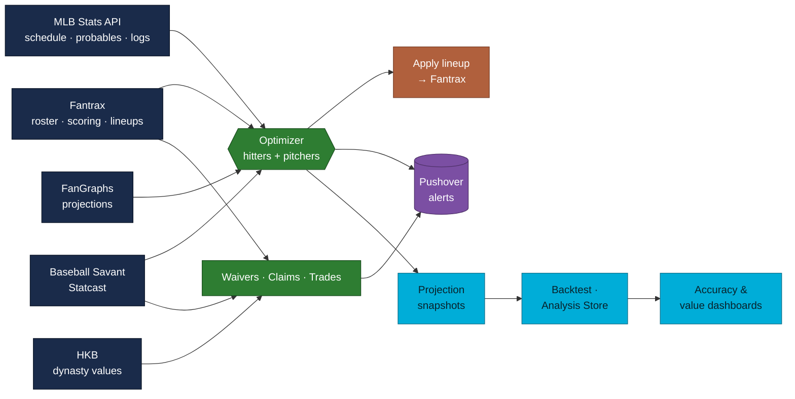

<div align="center">

# ⚾ RosterBot

**An autonomous manager for Fantrax head-to-head points leagues.**
It sets the lineup every hour, works the waiver wire, watches the league, and grades its own decisions — no human at the keyboard.


</div>

---

RosterBot is a single Go binary of Cobra subcommands that pulls from five live data feeds, makes a lineup decision, and writes it straight back to Fantrax — then keeps a running record of how good that decision turned out to be. It runs unattended on AWS, but every command works locally in a read-only `--dry-run` mode so you can watch it think before it touches a roster.

## How it thinks


```mermaid
flowchart LR
    FT["Fantrax<br/>roster · scoring · lineups"]:::src
    MLB["MLB Stats API<br/>schedule · probables · logs"]:::src
    FG["FanGraphs<br/>projections"]:::src
    SV["Baseball Savant<br/>Statcast"]:::src
    HKB["HKB<br/>dynasty values"]:::src

    FT --> OPT
    MLB --> OPT
    FG --> OPT
    SV --> OPT

    OPT{{"Optimizer<br/>hitters + pitchers"}}:::eng

    OPT --> APPLY["Apply lineup<br/>→ Fantrax"]:::act
    OPT --> PUSH[("Pushover<br/>alerts")]:::note
    OPT --> SNAP["Projection<br/>snapshots"]:::data

    FT --> WIRE
    SV --> WIRE
    HKB --> WIRE
    WIRE["Waivers · Claims · Trades"]:::eng
    WIRE --> PUSH

    SNAP --> GRADE["Backtest ·<br/>Analysis Store"]:::data
    GRADE --> DASH["Accuracy &<br/>value dashboards"]:::data

    classDef src fill:#1A2B4A,stroke:#0b1526,color:#fff;
    classDef eng fill:#2E7D32,stroke:#1b4d1f,color:#fff;
    classDef act fill:#B0603D,stroke:#7a3f27,color:#fff;
    classDef note fill:#7B4FA3,stroke:#4f3169,color:#fff;
    classDef data fill:#00ADD8,stroke:#0b6f8a,color:#08222b;
```

**Statcast picks _who_ surfaces on the wire; FanGraphs scores _how much_ each player is worth under this league's own scoring weights.** That separation runs through the whole codebase — the optimizer never guesses at value it can compute.

## What it does

- **Sets the daily lineup** — A backtracking optimizer finds the globally optimal hitter slot assignment; a separate pitcher optimizer respects probable starters and the weekly games-started budget. Projections blend FanGraphs with recent rolling stats, so hot and cold streaks move the needle.
- **Reads the real box score** — Checks actual MLB starting lineups, so a player getting a rest day is benched in favor of someone actually in the order.
- **Works the waiver wire** — Cross-references free agents against Baseball Savant to surface **buy-low** candidates (expected stats outpacing surface stats) and **hot** streaks (recent production backed by barrel and hard-hit quality), ranked by projected fantasy points.
- **Recaps the wire** — A league-wide daily recap of processed CLAIM/DROP moves, valued by HKB dynasty rankings, with a per-team leaderboard, a notable-drops watch, and Statcast tags on every pickup. Writes an audit ledger and uses a cursor to never alert twice.
- **Monitors prospects** — Scans MLB transactions, MiLB breakouts, and prospect boards (MLB Pipeline → FanGraphs) for call-up alerts, hot streaks, and upgrade recommendations.
- **Watches the league** — Trade monitor (valued by HKB), roster-hygiene alerts (players stuck in the wrong slot), and a league-wide games-started violation checker.
- **Grades the tape** — Backtests past lineups against the hindsight-optimal lineup, and grades every projection against the fantasy points that actually scored — sliced by position and by projection system.
- **Tells the story** — Sleeper-style weekly HTML recaps with a Game-of-the-Week win-probability chart, League Leaders board, and comeback/lead-change awards.
- **Publishes dashboards** — A daily projection-accuracy dashboard (scorecard, trend, per-position MAE, calibration, worst misses, model comparison), a per-team dynasty-value tracker, and an infra status page showing the freshness of every durable and ephemeral data store — all served as a private SPA behind a passkey.

---

## Quick start

**Prerequisites:** Go 1.26+ and Chrome (headless, for Fantrax's browser-based auth).

**1 — Configure.** Create a gitignored `.env`:

```dotenv
FANTRAX_USERNAME=your_username
FANTRAX_PASSWORD=your_password
FANTRAX_LEAGUE_ID=your_league_id
FANTRAX_TEAM_ID=your_team_id
FANTRAX_IL_SLOTS=3
FANTRAX_MINORS_SLOTS=5
```

**2 — Build.**

```bash
make build      # produces ./rosterbot
make install    # installs to $GOPATH/bin
```

**3 — Watch it work (read-only).**

```bash
rosterbot optimize --dry-run          # today's optimal lineup, applies nothing
rosterbot waivers  --dry-run          # Statcast-driven free-agent picks
rosterbot scoring                     # print the league's scoring weights
```

> [!TIP]
> Every command that changes state supports `--dry-run`. Drop the flag to apply for real. `make run-all` sweeps every command in dry-run / read-only mode — the fastest end-to-end sanity check.

Working from [Claude Code on the web](https://code.claude.com/docs/en/claude-code-on-the-web) instead of a local checkout? See **[docs/cloud-sessions.md](docs/cloud-sessions.md)** for the network allowlist this repo's data sources need, the setup script, and what a cloud session cannot do.

---

## Command reference

The manager's day, grouped by job. Each group folds open.

<details>
<summary><b>Set the lineup</b> — <code>optimize</code></summary>

```bash
# Today (dry run)
rosterbot optimize --dry-run

# A specific date, or a date range
rosterbot optimize --dry-run --dates 2026-04-01
rosterbot optimize --dry-run --dates 2026-03-26:2026-03-28

# All remaining days in the current matchup period (what the hourly job runs)
rosterbot optimize --dry-run --matchup

# Show the full hitter adjustment pipeline: base → blend → park → platoon → opp SP → final
rosterbot optimize --dry-run --pipeline

# Swap projection system (default: depthcharts; in-season: depthcharts-ros)
#   steamer · depthcharts · thebatx · atc  (+ each system's -ros rest-of-season variant)
rosterbot optimize --dry-run --projections atc
rosterbot optimize --dry-run --projections steamer-ros

# Force fresh data (bypass every cache layer)
rosterbot optimize --dry-run --no-cache

# Archive today's projections so a later backtest can grade them exactly
rosterbot optimize --dry-run --snapshot
```

Remove `--dry-run` to apply. The optimizer is idempotent: a second run with the same inputs reports "No changes needed."

</details>

<details>
<summary><b>Work the wire</b> — <code>waivers</code> · <code>claims</code> · <code>prospects</code> · <code>transactions</code></summary>

```bash
# Statcast-driven free-agent picks (buy-low + confirmed hot streaks)
rosterbot waivers --dry-run
rosterbot waivers --dry-run --top 25              # bigger list
rosterbot waivers --dry-run --positions OF,SP     # filter to slots

# Daily recap of processed CLAIM/DROP moves, valued by HKB
rosterbot claims --dry-run
rosterbot claims --dry-run --no-signals           # skip Statcast enrichment
rosterbot claims --dry-run --drops-min 3000       # only flag drops above an HKB value
rosterbot claims --dry-run --since 2026-06-01     # one-off historical recap

# Prospect report (call-ups, MiLB breakouts, ranking upgrades)
rosterbot prospects --dry-run

# Recent league trades, each side valued by HKB
rosterbot transactions --dry-run
```

</details>

<details>
<summary><b>Mind the rules</b> — <code>gs-check</code> · <code>scoring</code> · <code>version-check</code></summary>

```bash
# League-wide games-started violation check (most recently completed period)
rosterbot gs-check --dry-run

# Print the league's stat → fantasy-point weights
rosterbot scoring

# Probe Fantrax with the pinned API version, unauthenticated
rosterbot version-check
```

`gs-check` needs `GS_TRACKING_ENABLED=true` plus Pushover credentials; it's a clean no-op when tracking is off.

`version-check` exits non-zero on a confirmed `STALE_CLIENT` rejection — an inconclusive probe (transport error, unrecognized response) exits 0 with a warning rather than raising a second alert for a Fantrax outage that every other scheduled job already pages through.

When the pin reads OK, a second probe sends a deliberately obsolete version as a positive control. Fantrax's gate is a *minimum* check, so a working gate must reject it; if it doesn't, the gate has stopped discriminating and every "version OK" reading is meaningless, which also exits non-zero (`PROBE_BLIND`). Without it a broken probe reads green forever and no heartbeat can tell — the job does launch and does exit 0.

</details>

<details>
<summary><b>Invite someone to the dashboard</b> — <code>invite</code></summary>

```bash
# Mint a single-use enrollment link for one person
rosterbot invite --email dave@example.test --name Dave --team team-7

# Preview without minting anything
rosterbot invite --email dave@example.test --dry-run
```

Passkeys are the only login method — no passwords, no reset flow, no
verification mail. An admin mints a link, hands it over out-of-band, and the
person enrolls a passkey with it.

The dashboard's admin **Tenants** tab mints the same invite and recovery links
(`POST /v1/tenants/invite`, `POST /v1/tenants/{id}/recovery`) and carries the
per-tenant management controls: park/reactivate (`POST /v1/tenants/{id}/status`
— a parked tenant can't sign in and their scheduled jobs stop), a
lineup-writes kill switch (`POST /v1/tenants/{id}/auto-apply`), team binding
(`POST /v1/tenants/{id}/team` — the twin of `user set-team` below, and the only
control on this page that clears connect's `no_team` refusal; it *re*assigns
nothing, since taking a second claim without releasing the first would leave
the old team owned by nobody), and permanent
removal (`DELETE /v1/tenants/{id}` — deletes the account, passkeys and Fantrax
connection, and releases the email/team claims so both can be reused). Each
row also shows a passkey count, so "invited but never registered" is visible
at a glance.

Each row carries a bounded **run summary** as well — that tenant's last run,
their last failure, and how many of their last 25 ledger records failed —
resolved through the same per-tenant view `GET /v1/runs` serves. It is on this
route rather than as a `?tenant=` parameter on `/v1/runs` because the admin gate
is a path allowlist: a query string reaches no gate at all, so that version
would let any member read any tenant's ledger and per-run output. Read the cell
carefully in three places. An empty summary ("Never run") means the ledger read
fine and holds nothing; a missing one (`?`) means it could not be read, and is
never shown as zero. The failure count is deliberately paired with the span it
covers, because 25 records is roughly a day and a half of the hourly lineup job
— a weekly job's failure ages out of it. And a `connect` run that fails for a
reason only the tenant can fix exits 0 on purpose, so it is labelled by the
connect task's own verdict rather than by its exit status.

Each row's **Runs** button opens that tenant's full ledger and, on a row
click, that run's captured output (`GET /v1/tenants/{id}/runs` and
`GET /v1/tenants/{id}/runs/{runID}/output`) — the drill-down an operator
reaches for once the bounded summary above flags a tenant. Both are nested
under `/v1/tenants/{id}/`, inheriting the same admin-only gate, and resolve
the named tenant's own stores rather than the caller's.

The token is printed **once** and is not recoverable: only its SHA-256 is
stored, so a leak of the identity table yields no usable links. The link is
single-use, scoped to one user, and redeemed only when a registration actually
completes — an abandoned ceremony leaves it usable.

`--team` is optional to the flag, but a user without one **cannot connect
Fantrax** — `connect` refuses with `no_team`, because an empty team gives the
ownership check nothing to prove against. Repair an existing record from the
Tenants tab's **Set team** control, or with `user set-team` below.

</details>

<details>
<summary><b>Assign a Fantrax team to an existing user</b> — <code>user set-team</code></summary>

```bash
# Bind a team to a user that already exists
rosterbot user set-team --user <user-id> --team team-7

# Report the transition without writing
rosterbot user set-team --user <user-id> --team team-7 --dry-run
```

`invite --team` only sets the team at creation, so this is the way to fix a
record that has none — including the operator's own, which neither
`migrate-identity` nor the dashboard bootstrap gives a team.

This records **which** team to prove, not permission to use it. Ownership is
still established at connect time against Fantrax's own `MyTeamIDs`, so naming
the wrong team here does not grant access to it — it makes that user's next
connect fail with `team_not_owned`.

Two refusals are deliberate. A team already held by another user is an error,
never a warning: two tenants on one Fantrax team means both hourly jobs optimize
and apply to the same roster, each reading the other's changes as drift, fighting
every hour, invisibly. And a user who already holds a *different* team is refused
rather than moved, because the underlying claim is not released on reassignment —
the old team would stay recorded as theirs and become unassignable to anyone.

New accounts are members with `auto_apply` **off**. Full flow, recovery from a
lost device, and the troubleshooting table: **[docs/user-registration.md](docs/user-registration.md)**.

The settings page also lets each user pick the **projection model** their
lineup runs use — hitters and pitchers independently, from Steamer / Depth
Charts / THE BAT X / ATC (`POST /v1/me/preferences`, fields
`hitter_projection` / `pitcher_projection`). Unset means "follow the
deployment default" (Depth Charts); in season the rest-of-season variant is
applied automatically, and an explicitly typed `--projections` flag still
overrides both roles for that run.

</details>

<details>
<summary><b>Grade the tape</b> — <code>backtest</code> · <code>shadow</code> · <code>grade</code></summary>

```bash
# Grade last completed matchup week: lineup Gap + projection accuracy
rosterbot backtest
rosterbot backtest --dates 2026-04-13:2026-04-19
rosterbot backtest --skip-projections               # lineup-only, faster
rosterbot backtest --json                           # machine-readable: adds the GS-gate
                                                    # and roster-shape sections too

# Compare recency-weighting strategies (YTD vs 14d/30d/decay) by lineup Gap
rosterbot backtest --recency-experiment --dates 2026-05-01:2026-05-14

# Capture every projection system's lineup projections (read-only) for model comparison.
# Runs the optimize pipeline once per RoS system in dry-run; the next day's `grade` scores it.
rosterbot shadow
rosterbot shadow --dates 2026-06-30

# Materialize projected-vs-actual rows into the Analysis Store (feeds the dashboard + Athena)
rosterbot grade
```

The report also prints a **roster shape** block: the share of deployable
projected value each side of the roster actually fielded, against the league's
slot counts and weekly game-start cap. Each side is normalized against its own
owned value, so the two rates are comparable without reducing to the slot ratio.
Days whose snapshots predate roster-status capture are excluded and named.

</details>

<details>
<summary><b>Tell the story</b> — <code>recap</code> · <code>recap-site</code></summary>

```bash
# Sleeper-style HTML recap of the most recently completed matchup week
rosterbot recap --out /tmp/recap.html
rosterbot recap --dates 2026-04-20:2026-04-26 --out /tmp/recap.html
rosterbot recap --out /tmp/recap.html --open        # render + open in browser

# Build the multi-week static site (one HTML per completed week + index.html)
rosterbot recap-site --out dist
```

</details>

<details>
<summary><b>Keep the books</b> — <code>archive</code> · <code>team-values</code> · <code>projection-site</code></summary>

```bash
# Durable daily snapshot of ephemeral upstream data (HKB, projections, Savant, prospects)
rosterbot archive --dry-run                         # fetch + print sizes, write nothing
rosterbot archive                                   # capture today (the only date it can capture)

# Append today's per-team aggregate HKB dynasty value to the Team Value Store
# (broken out hitter/pitcher × MLB/minors; the series accumulates forward, one point per day)
rosterbot team-values --dry-run
rosterbot team-values --date 2026-07-12

# Render dashboard data from the stores. Output is split by who may read it:
#   private (state bucket's reports/ prefix, .reports/ locally, served only via
#            the passkey-gated GET /v1/reports/{name}): model, gap, views
#   public  (<out>, published to the dashboard bucket's report/ prefix): value.json, football.json, football-trades.json
# The dashboard SPA fetches both sets and renders them client-side — projection-site writes no HTML.
rosterbot projection-site --out report
rosterbot projection-site --out report --open
```

</details>

<details>
<summary><b>Dynasty football</b> — <code>football-values</code> · <code>football-trades</code> (Sleeper + StatsGuy)</summary>

The bot's second sport. Read-only: Sleeper's public API has no lineup-write endpoint, so there's no `optimize`/apply equivalent here — just a value store and a trade monitor. Needs only `SLEEPER_LEAGUE_ID`, not any `FANTRAX_*` credential.

```bash
# Append today's per-player dynasty value rows (players + owned future picks) to the Dynasty Value Store
rosterbot football-values --dry-run
rosterbot football-values --date 2026-08-11

# Poll Sleeper for newly completed trades and push a graded Pushover alert
rosterbot football-trades --dry-run
rosterbot football-trades --relog --dry-run   # one-shot log backfill for already-alerted trades
```

Starters value is the headline (not the full-roster total) — starters coverage against StatsGuy's value grid is consistently near-complete, full-roster coverage isn't. The full-roster total still prints, alongside its own matched/rostered coverage counts. On both value tabs (Football and the baseball Value tab), hovering — or, on touch, tapping — a coverage cell that shows a shortfall lists the rostered players that did not join to a value — the names are captured at write time, so days written before that shipped say so rather than claiming nobody was missed. Trade grading is a local sum over the same StatsGuy bundle the value store reads (no package-decay adjustment — measured: StatsGuy applies none); a trade with any unpriced asset (an unresolvable pick round, a FAAB-only side — StatsGuy prices players and picks, not cash) suppresses the verdict rather than reporting a partial total. `football-trades` is idempotent across repeated runs via a per-trade dedup marker, and appends every alerted trade to a durable log (`football/trades/log/`, or `.football/trades/log/` locally) that the dashboard's Football tab renders beneath the standings. Each row stores its values **as priced when the trade was graded**, in all four StatsGuy formats — StatsGuy publishes no history, so re-deriving an old trade would price it against today and present that as what it was worth then. Trades alerted before the log existed can be rebuilt with `football-trades --relog`, which recovers their identity from Sleeper, prices them at today's values, and marks the rows `regraded` so the tab says so rather than implying otherwise. The log is written by the six-hourly poller but published by the daily `projection-site` run, so a brand-new trade can take up to a day to reach the dashboard.

</details>

<details>
<summary><b>Serve</b> — <code>serve</code> (read-only lineup API + web dashboard)</summary>

```bash
# Publish today's lineup JSON without touching your roster, then serve it
rosterbot optimize --dry-run --publish-lineup       # writes .lineup/lineup-today.json
ROSTERBOT_API_TOKEN=test ROSTERBOT_SESSION_SECRET=test-secret rosterbot serve
open http://localhost:8080/                          # dashboard bootstrap screen
```

See [Lineup API & dashboard](#lineup-api--dashboard) below for the full contract.

</details>

> [!NOTE]
> A handful of internal plumbing commands (`run-ledger`, `migrate-run-ledger`, `sync-up`, `sync-down`) are invoked by `entrypoint.sh` on AWS and aren't meant for interactive use.

---

## How the optimizer works

### Hitters

Backtracking with pruning finds the slot assignment that maximizes total expected points, respecting position eligibility (`C · 1B · 2B · 3B · SS · INF · OF · UT`) and preferring fewer roster moves when assignments tie. A player whose team isn't playing, who's confirmed out of the real MLB lineup, or who's injured / in the minors contributes 0 points and gets benched.

### Pitchers

Pitchers are scored off probable-starter data. A confirmed SP start gets full value; an SP not listed as probable gets a `0.05×` discount so relievers are preferred for scarce P slots. With `GS_TRACKING_ENABLED=true`, a games-started budget gate fetches the real GS limit live from Fantrax's own per-period config (which scales it whenever a period spans more than one calendar week, e.g. the All-Star break) and keeps only the highest-value starts across the matchup period.

The same gate also watches the league's weekly GS **minimum**. Protecting starts from the ceiling-side cut is all the optimizer itself can do — MLB names the probables, so it can never manufacture a start on a day none of your arms has the ball — so when the matchup week projects to finish under the minimum with days still to play, the hourly `optimize` run raises one alert per week naming **the days on which no rostered starter has a turn**. That is the actionable part: the fix is claiming a starter whose turn falls on an open day, and it needs lead time. The alert stays quiet on a week that reaches the floor, on a league with no minimum configured, once too few days remain to act, and during the opening days of a week — when too little of the rotation has been announced for the projection to mean anything.

### Projection blending

Projections blend FanGraphs season numbers with recent Fantrax scoring, weighted **dynamically** by sample size. The recent signal is a **trailing 30-day window** for hitters and **season-to-date** for pitchers:

| Games in recent signal | Projection weight | Recent weight |
|---|--:|--:|
| Few (≈4)               | 94% | 6%  |
| Many (≈66)             | 50% | 50% |
| Stabilized (150+)      | 30% (floor) | 70% |

For **hitters**, only games inside the trailing 30 days count (caps around 26), so recent weight tops out near ~28% while reflecting current form only. The 30-day window replaced unbounded season-to-date after a full-season backtest showed it earns ~1 more realized point per game each day (`backtest --recency-experiment`). For **pitchers**, it's season-to-date games with role-aware stabilization (SP reaches 50/50 at 15 GP, RP at 25 GP, floor 35%) — recency was measured immaterial for pitchers, so they stay on season-to-date. Both require `BLEND_MIN_GP` (default 2) games before recent stats factor in, and fall back to 100% projection when there's no recent data.

Matchup adjustments (opposing-pitcher FIP + platoon splits) layer on top.

---

## Automation

> [!IMPORTANT]
> As of **2026-06-16**, scheduled jobs run as **ECS Fargate tasks** launched by **EventBridge** (account `476646938644`, `us-west-1`), defined in AWS CDK (Go) under [`infra/`](infra/). There are no GitHub Actions cron workflows. Full operations, schedule mapping, image builds, and the cutover/rollback procedure live in **[`docs/aws-deployment.md`](docs/aws-deployment.md)**.

The bot's game day, ordered by clock (times shown in ET for reading; the authoritative schedule expression is in the last column):

| When (ET) | Job | Command | Schedule (as configured) |
|---|---|---|---|
| Hourly, 11a–10p | Set the lineup | `optimize --matchup` | every hour 8am–7pm **PT** |
| 6:30a | API version check | `version-check` | 10:30 UTC daily |
| 7:00a | Prospects | `prospects` | 7am ET daily |
| 8:00a | GS check | `gs-check` | 8am ET daily |
| 9:00a | Waivers | `waivers` | 9am ET daily |
| 9:30a | Grade projections | `grade` | 13:30 UTC daily |
| 10:00a | Claims recap | `claims` | 10am ET daily |
| 10:00a | Trades | `transactions` | 10am ET daily |
| 10:00a | Archive | `archive` | 14:00 UTC daily |
| 10:30a | Team values | `team-values` | 14:30 UTC daily |
| 11:00a | Dashboard data | `projection-site --out report` | 15:00 UTC daily |
| 7:00a Mon | Weekly recap site | `recap-site --out dist` | 7am ET Mondays |
| 7:40p | Shadow capture | `shadow` | 23:40 UTC daily |

`entrypoint.sh` publishes the recap site from `./dist` to `SITE_BUCKET`, and the **public** dashboard data (`report/value.json`, `report/football.json` + `report/football-trades.json`) into `DASHBOARD_BUCKET`'s `report/` prefix — the same CloudFront distribution as the dashboard SPA. Any job can also be launched on demand as a one-off Fargate task (or via `POST /v1/jobs/{name}` — see below).

The **private** dashboard data — the projection-accuracy model, the lineup gap and recap readership — does not go there. That prefix is served by CloudFront's default behavior with no auth, and those three are your own performance: how many points your lineup left on your bench, how your projections graded, who reads your site. They are written to `STATE_BUCKET`'s `reports/` prefix, which no distribution fronts, and reach the SPA through the passkey-gated `GET /v1/reports/{name}` — the same reasoning that put the Trades tab on `/v1/*`. Only league-wide standings, which every manager can already read off Fantrax and Sleeper, stay public.

For a local dashboard preview, run `rosterbot projection-site --out web/dashboard/report` (delete that dir afterward — it isn't committed) and then `rosterbot serve`, which reads the private reports back out of `.reports/` and serves them on the same authenticated path the Lambda does.

<details>
<summary><b>Model auditing (Analysis Store + Athena)</b></summary>

The daily `grade` job materializes projected-vs-actual rows to S3 as NDJSON, queryable in Athena (workgroup `rosterbot`, table `rosterbot_analysis.grades`), partitioned by `dt` and by `system` (the projection system that produced each projection — captured daily by `shadow`).

```sql
-- Projection accuracy by position since June, for the production system
SELECT bucket, count(*) n, avg(abs(diff)) mae, avg(diff) bias
FROM rosterbot_analysis.grades
WHERE dt >= '2026-06-01' AND system = 'depthcharts-ros'
GROUP BY bucket ORDER BY mae DESC;

-- Head-to-head: which base projection system is most accurate?
SELECT system, count(*) n, avg(abs(diff)) mae, avg(diff) bias
FROM rosterbot_analysis.grades
WHERE dt >= '2026-06-01'
GROUP BY system ORDER BY mae ASC;
```

</details>

---

## Lineup API & dashboard

### Read-only lineup API

`GET /v1/lineup/today` returns today's optimized lineup as JSON for the iOS thin client. It's **precompute-then-serve**: the hourly `optimize` run publishes the JSON to object storage (S3 `lineup/` prefix on AWS, `.lineup/` locally), and the endpoint just authenticates and returns those bytes — it never re-runs the optimizer or logs into Fantrax.

```jsonc
{
  "date": "2026-06-17",
  "league_id": "...", "team_id": "...",
  "slots": [
    { "slot": "C",  "player": { "id": "...", "name": "...", "team": "NYY",
                                "pos": ["C"], "age": 27.3, "hkb_value": 5210,
                                "proj": 3.4, "status": "OK" } },
    { "slot": "BN", "player": null }        // empty/open slots are null
  ],
  "projected_points": 41.7,
  "warnings": ["Vlad Guerrero benched in real lineup"]
}
```

`player.status` is `OK`, `LOCKED` (game in progress/final), or `BENCHED` (out of the real MLB lineup). Requests carry `Authorization: Bearer <ROSTERBOT_API_TOKEN>`. On AWS it's a Go Lambda behind a Function URL (`LineupApiUrl` stack output; token at SSM `/rosterbot/ROSTERBOT_API_TOKEN`).

`age` and `hkb_value` are the dynasty enrichment, joined from the HKB rankings by normalized name. **Both are optional and both are absent — not zero — when HKB has no row for the player**, which happens routinely for a recent call-up and for every player if the scrape itself fails. The enrichment is deliberately soft: `optimize` publishes the lineup without it rather than failing, so a client must treat a missing field as *unknown* rather than as an age of 0 or a worthless asset.

<details>
<summary><b>Control endpoints (AWS only)</b> — run ledger + on-demand job triggering</summary>

The same Lambda exposes a run ledger and job triggering (these return `501` from local `serve`, which has no ECS):

| Method & path | Purpose |
|---|---|
| `GET /v1/runs` | Recent runs (scheduled + manual), newest first: `{id, command, status, exit_code, started_at, ended_at, trigger}`. `status` ∈ `RUNNING`/`SUCCESS`/`FAILED`. |
| `GET /v1/runs/{id}` | One run plus `log_tail` (captured output, populated on failures). |
| `GET /v1/runs/{id}/progress` | Live phase progress for an in-flight run: `{phase, pct, phases:[…], status, updated_at}`. `404` when a run has no progress recorded. |
| `POST /v1/jobs/{name}` | Launch a job as a Fargate task (async). Returns `202`; poll `/v1/runs`. Allowlist: `optimize, waivers, prospects, claims, gs-check, transactions, recap-site, backtest, grade`. |
| `GET /v1/infra` | State-bucket health, listed **live** per request: one row per durable/ephemeral artifact with `health` (`ok`/`gap`/`stale`/`missing`/`unknown`), object count, size, age, `dt=` partition count and sub-dimension coverage. |
| `GET /v1/trades` | Pending trade offers involving your team, both sides HKB-priced, with a verdict and the roster-composition impact of accepting. Written hourly by `optimize`. |
| `GET /v1/trades/values` | The league values table: every rostered player joined to its HKB dynasty value, grouped by owner, plus HKB's 18 draft-pick assets. Written daily by `team-values`. |
| `GET /v1/sleeper/leagues` | Discover a Sleeper account's leagues by `?username=` (plus optional `sport`, default `nfl`, and `season`, defaulting to the season a date falls in — Sleeper labels a season by the year it *starts*). Proxied server-side so no client learns Sleeper's API shape. `404` for an unknown username, `502` for a Sleeper outage — never an empty `200`, since those are different answers and only one is worth retrying. |
| `GET/POST/DELETE /v1/memberships` | The caller's own leagues across platforms. `POST` and `DELETE` are **Sleeper-only**: a Fantrax membership is established by the invite and proven against Fantrax at connect time, never asserted by its owner. One league per `POST` (no batch body); a duplicate is `409`, and removing an absent league succeeds. Passkey session required — the bearer token carries no user identity. |

`/v1/infra` reads S3 on demand rather than serving a precomputed file — a status page built from a scheduled artifact would go stale in exactly the situation it exists to detect. It reports its own `generated_at` so the client can prove the reading is current. Two signals matter most: **gap detection** on date-partitioned series, flagged as a failure only where the days can never be refilled (the Team Value Store — HKB has no history, so a missed day is gone for good), and **sub-dimension coverage**, which makes one of the four shadow projection systems silently stopping visible as a missing chip.

A Sleeper membership is **recorded, not yet consumed**: `football-values` still reads the deployment-wide `SLEEPER_LEAGUE_ID`, so connecting a league in Settings stores it on the account and nothing downstream reads it yet. The Settings copy says exactly that rather than implying personalization.

Run **status** always comes from the run ledger; `/progress` only adds phase detail on top of it. Today only `optimize` emits phases — the other allowlisted jobs show an indeterminate bar.

> [!WARNING]
> Triggered jobs run **for real** — `POST /v1/jobs/optimize` applies your lineup and sends notifications. Gate it behind a confirmation in any client.

</details>

<details>
<summary><b>Web dashboard</b> — private SPA, passkey auth, live run status</summary>

A private, single-user web UI over the API: today's lineup, a form to trigger any of the allowlisted jobs, run history with live status, and a viewer for each job's typed output. The lineup rows carry each player's age and HKB dynasty value, each shaded on its own single-hue heatmap scaled to that day's lineup — age proportionally, value on a square root, since dynasty values are top-heavy enough that a proportional ramp leaves everyone below the best player the same shade. The number is always printed, so the shading is a scanning aid rather than the only way to read the column. The **Projections** and **Value** tabs render natively from `projection-site`'s output (client-side Chart.js, no iframe) — Projections and Views over the authenticated `GET /v1/reports/{name}`, Value over the public `report/value.json`. Static files live in [`web/dashboard/`](web/dashboard/) (no build step — plain ES modules) and deploy to their own CloudFront distribution, served at **https://rosterbot.dev** (the apex, and the WebAuthn RP ID) and **https://dash.rosterbot.dev** (`DashboardUrl` stack output). The recap site is at **https://recaps.rosterbot.dev** and still serves on its original `*.cloudfront.net` name too. The dashboard's `*.cloudfront.net` name is **deprecated** — it 301s to the apex, because it stopped being the RP ID at rosterbot-jloe.4 and had become a login page that renders perfectly and then refuses the passkey.

The **Trades** tab answers one question: *should I take this offer?* Each pending offer is priced two ways — a plain sum of HKB dynasty values, and a sum that discounts every asset after the best — and a winner is named **only when the two agree**. On the live 2-for-1 that motivated the tab they name opposite sides, so it reports *too close to call* rather than picking one. An offer containing a draft pick gets no verdict at all: Fantrax identifies picks only as blank rows, and a pick can outweigh everything beside it. Below the verdict, *If you accept* shows what the trade does to your hitter/pitcher × MLB/minors value and your league rank in each — a trade can be dead even on value and still move you several places. The tab also carries the full league values table, filterable by player and owner. Like the Projections and Views tabs it is served from `/v1/*` rather than the world-readable `report/` prefix, since an open offer shouldn't be public before you've decided on it.

The **Projections** tab leads with a *Decision quality* block: points left on the bench versus the hindsight-optimal lineup, lineup efficiency, and within-day rank skill (mean Spearman rho, with standard error and days-positive) for hitters and pitchers separately. MAE, bias and RMSE remain below as calibration diagnostics, each MAE figure annotated with its skill score against a constant-at-sample-mean baseline.

Triggering a job hands you into a live **"Now Running" hero**: a phased progress bar for `optimize`, an indeterminate bar for the other jobs, and an elapsed clock. Finishing a watched run fires a success/failure toast.

**Auth is a passkey (WebAuthn), not the token.** On first visit with zero passkeys registered, a bootstrap screen asks for `ROSTERBOT_API_TOKEN` once to register your first passkey (Face ID / Touch ID / hardware key); every visit after is a normal passkey login. A signed, stateless session cookie (HMAC; `ROSTERBOT_SESSION_SECRET` locally, SSM `/rosterbot/DASHBOARD_SESSION_SECRET` on AWS) carries each `/v1/*` call — no server-side session store. The token still works as a Bearer header for CLI/scripting and doubles as the break-glass credential.

```bash
# Run the dashboard + API from one local server (the same split CloudFront does in prod)
rosterbot optimize --dry-run --publish-lineup
ROSTERBOT_API_TOKEN=test ROSTERBOT_SESSION_SECRET=test-secret rosterbot serve
open http://localhost:8080/        # bootstrap: paste "test", register a passkey
```

`serve --web <dir>` serves the static files at `/` and the API at `/v1/*`. WebAuthn is configured for RPID `localhost`, so passkeys work against `http://localhost:8080` with no HTTPS. Job triggering returns `501` locally (no ECS); everything else works against real local files under `.lineup/`.

</details>

---

## Configuration

Required for the baseball (Fantrax) commands (via `.env` locally, SSM `/rosterbot/*` on AWS): `FANTRAX_USERNAME`, `FANTRAX_PASSWORD`, `FANTRAX_LEAGUE_ID`, `FANTRAX_TEAM_ID`, `FANTRAX_IL_SLOTS`, `FANTRAX_MINORS_SLOTS`.

Required for the dynasty football (Sleeper) commands — `football-values`, `football-trades` — and *only* those; no `FANTRAX_*` var is needed to run them: `SLEEPER_LEAGUE_ID`.

Optional:

| Env var | Default | Description |
|---|---|---|
| `GS_TRACKING_ENABLED` | `false` | Enables games-started tracking (optimizer budget + `gs-check`). Real min/max are always fetched live from Fantrax — never a fixed number. |
| `BLEND_MIN_GP` | `2` | Minimum games played before recent stats blend into a projection. |
| `PROSPECT_ROLLING_DAYS` | `14` | Days of MiLB stats used for breakout detection. |
| `PROSPECT_MIN_GAMES` | `8` | Minimum games for prospect breakout eligibility. |
| `PROSPECT_RANK_CACHE_HOURS` | `168` | Hours to cache prospect rankings. |
| `PROSPECT_UPGRADE_RANK_THRESHOLD` | `20` | Prospect rank threshold for upgrade alerts. |
| `PUSHOVER_USER_KEY` | — | Personal **operator** channel (connect blocked, stale-cache fallback, GS limit fetch failure, projection status) — and the target of fantasy dual-send while `PUSHOVER_FANTASY_DUAL_SEND` is set. Retained permanently. |
| `PUSHOVER_GROUP_KEY` | — | Group channel (league-wide GS violation broadcast). Retained permanently — league mates without the app are unreachable by APNs. |
| `PUSHOVER_API_TOKEN` | — | Pushover application token — shared by every Pushover send, baseball or football. |
| `PUSHOVER_FANTASY_DUAL_SEND` | unset | Cutover flag: while set, every fantasy event goes to Pushover **and** APNs. Remove the variable to complete the migration off Pushover for fantasy events — no code change, no deploy of new code. |
| `APNS_AUTH_KEY` | unset | APNs provider auth key (the `.p8` body, PEM). With `APNS_KEY_ID`, `APNS_TEAM_ID`, `IDENTITY_TABLE` and a tenant set, fantasy events push to the tenant's registered iOS devices; unset, push is silently disabled and the activity feed still records everything. |
| `APNS_KEY_ID` | unset | Key ID of the APNs auth key. |
| `APNS_TEAM_ID` | unset | Apple developer team id the provider token signs as (set in infra; not a secret). |
| `DYNASTY_FORMAT` | `sf_dynasty` | Which StatsGuy format (`sf_dynasty`/`non_sf_dynasty`/`sf_redraft`/`non_sf_redraft`) a football command's own printed summary reads. The Dynasty Value Store itself always records all four. |
| `FOOTBALL_PUSHOVER_USER_KEY` | `PUSHOVER_USER_KEY` | Reserved. `football-trades` alerts now route through the notify dispatcher (activity feed + APNs + dual-send) rather than this key. |
| `FOOTBALL_PUSHOVER_GROUP_KEY` | `PUSHOVER_GROUP_KEY` | Reserved for a future football group broadcast; not currently sent to. |

---

## Caching

Network calls (Fantrax, MLB statsapi, FanGraphs, Baseball Savant, HKB, MLB Pipeline) are cached on disk under `.cache/` as JSON, named `<source>-<entity>-<scope>.json` (e.g. `fantrax-pitcher-gs-<teamID>-<season>-<period>.json`). On AWS the same cache is backed live by S3 under the `cache/` prefix. Three TTL tiers cover most data:

| Tier | TTL | For |
|---|---|---|
| Past-period | **never expires** | Immutable once a scoring period closes *and stops settling* — per-period roster snapshots, recent stats, pitcher GS, GS limits, past-date MLB schedules, MLB player IDs. A period joins this tier only after the current period plus the three most recently closed ones, which stay on the 15-minute tier while Fantrax's year-to-date totals finish settling. Keys carry the season year so next season's period 5 can't read this season's entry. |
| Today | **15 minutes** | Drifts during the day but fine to reuse hourly — current roster, FA pool, current period, pending/recent trades. |
| Stable | **7 days** | Season-invariant config — slot counts, scoring weights, season date range. |

Provider-specific TTLs sit outside the tiers: **FanGraphs projections 24 h**, **Baseball Savant CSVs 24 h** (both single exported constants matching the once-daily upstream cadence), MLB handedness 7 d, HKB rankings 8 h, prospect rankings 168 h (`PROSPECT_RANK_CACHE_HOURS`), in-season MiLB game logs 1 h.

`--no-cache` bypasses every layer for that run. The cache is just a directory — `rm -rf .cache/` (or `make clean-cache`) is a safe reset that repopulates on demand.

> [!CAUTION]
> Don't delete `.fantrax-cache/` — that's the auth **session cookie**, not the data cache. Deleting it triggers a full chromedp browser login on the next run. On AWS it's synced to S3 under `session/`.

---

## Development

```bash
make test         # all unit tests — no credentials needed (everything is mocked)
make lint         # golangci-lint across all four modules
make lint-install # install the pinned golangci-lint version
make dry-run      # quick local optimize --dry-run
make clean-cache  # rm -rf .cache/ (cold-pass baseline)
make run-all      # exercise every command in dry-run / read-only, with timings + cache size
```

`make run-all` is the canonical end-to-end smoke test: it iterates every command with `time` on each step, prints the final `.cache/` size, and continues on errors so one broken step doesn't abort the sweep. Run cold-then-warm to see the cache speedup:

```bash
make clean-cache && make run-all 2>&1 | tee /tmp/cold.log
make run-all 2>&1 | tee /tmp/warm.log
```

> [!NOTE]
> `lambda/`, `opsnotify/`, and `infra/` are **separate Go modules** — the root `go build ./...` doesn't descend into them. Run `make build-modules` after touching any of them (or after a dependency bump); `make build` runs it automatically. Each module also carries its own `replace` line for any forked dependency, so `make check-pins` (also run by CI and `make build`) asserts those pins agree across every `go.mod` — a mismatch that changes no API would otherwise compile clean. When you add a new top-level command, append a line to the `run-all` recipe so the smoke test stays complete.

> [!NOTE]
> Linting is `make lint` (golangci-lint, config in `.golangci.yml` at the repo root, shared by all four modules). CI runs that same target rather than `golangci-lint-action`, so the gate that blocks a PR and the one you run locally are one definition. Install the pinned version with `make lint-install`; a missing binary is a hard error, not a skip.

---

## Architecture

One binary (`main.go`), Cobra subcommands (`cmd/`), and a set of focused internal packages. Leaf/data packages have no dependencies on the domain logic above them, which keeps the import graph acyclic and the pieces individually testable.

```
cmd/                    CLI commands (Cobra) + AWS entrypoint plumbing
internal/
  config/               env-var loading + validation
  positions/            Fantrax position-ID semantics (single source of truth)
  scoring/              stat → fantasy-point algebra (pure, zero-dep leaf)
  playername/           name → MLBAM ID resolution
  cache/                generic TTL FileCache[T] over a pluggable Store seam
  cachestore/s3store/   S3 adapter for the cache Store
  ndjsonstore/          shared NDJSON date-partitioned store plumbing (+ s3ndjson)

  fantrax/              Fantrax API client (public read + authenticated writes)
  schedule/             MLB Stats API (schedule, lineups, probable pitchers)
  projections/          FanGraphs projections, blending, park/matchup adjustments
  statcast/             Baseball Savant data + buy-low / hot signal engine
  hkb/                  HKB dynasty rankings
  optimizer/            pure-function lineup optimization (hitters + pitchers)
  lineuprun/            shared orchestration engine behind optimize + shadow
  progress/             live run-progress recording (phased dashboard hero)

  waivers/              Statcast-driven free-agent picks
  claims/               league-wide CLAIM/DROP recap + HKB valuation + ledger
  transactions/         trade monitor with HKB valuations
  tradevalue/           pure n-sided trade valuation + verdict (raw vs decayed)
  tradeboard/           Trades tab: offer snapshot, values table, offer log
  prospects/            minor-league prospect monitoring
  gscheck/              league-wide games-started violation checker
  roster/               roster-hygiene alerts

  backtest/             grade past lineups + projection accuracy
  analysis/             Analysis Store: GradeRow, Writer/Reader (NDJSON)
  report/               pure aggregation of grades → dashboard Model (JSON)
  teamvalue/            Team Value Store: per-team dynasty value over time
  valuereport/          pure aggregation of team values → dashboard Model (JSON)
  recap/                Sleeper-style weekly HTML recaps + WP model
  archive/              durable daily snapshots of ephemeral upstream data

  lineupapi/            read-only lineup + control HTTP handlers (+ s3lineup)
  statesync/            S3 ⇄ local state sync helpers
  teams/                team metadata (names, logos)
  notify/               fantasy-event dispatcher (feed record first, then APNs/Pushover sinks)
  apns/                 APNs HTTP/2 sender + stdlib ES256 provider-token JWT
  pushover/             Pushover HTTP client (stdlib-only leaf; used by opsnotify too)
```

---

## Docs

| Doc | What's inside |
|---|---|
| [`CONTEXT.md`](CONTEXT.md) | Domain glossary — the project's canonical vocabulary. |
| [`docs/aws-architecture.md`](docs/aws-architecture.md) | The AWS deployment at a glance (CDK, EventBridge, S3, CloudFront). |
| [`docs/aws-deployment.md`](docs/aws-deployment.md) | Operations runbook — schedules, image builds, cutover/rollback. |
| [`docs/ios-api-contract.md`](docs/ios-api-contract.md) | The thin-client HTTP contract served by the Lambda. |
| [`docs/adr/`](docs/adr/) | Architecture decisions — [S3-not-DB for the cache](docs/adr/0001-s3-not-db-for-cache.md), [Team Value Store accumulates forward](docs/adr/0002-team-value-store-accumulates-forward.md). |
| [`CLAUDE.md`](CLAUDE.md) · [`AGENTS.md`](AGENTS.md) | Contributor / agent guides (build commands, conventions, issue tracking). |

---

## License

[GNU General Public License v3.0](LICENSE).

rosterbot statically links [`go-fantrax`](https://github.com/pmurley/go-fantrax), which is GPL-3.0, so the
combined work is GPL-3.0 too — this isn't a free choice among licenses. If you redistribute rosterbot or a
binary built from it, you have to carry the same terms and offer the source.
