# RosterBot AWS Architecture

> Account `476646938644` · region `us-west-1` · all infra defined in CDK (Go) under `infra/infra.go`.
> Diagram derived directly from the CDK stack, `entrypoint.sh`, `lambda/main.go`, and `internal/lineupapi/handler.go`.

## System diagram

```mermaid
flowchart TB
    subgraph triggers["⏰ EventBridge schedules (UTC cron → ECS RunTask)"]
        direction TB
        T1["Lineup · hourly 14-23,0-3<br/><code>optimize --matchup --archive-projections</code>"]
        T2["Prospects · 11:00 · <code>prospects</code>"]
        T3["GsCheck · 12:00 · <code>gs-check</code>"]
        T4["Waivers · 13:00 · <code>waivers</code>"]
        T5["Transactions · 14:00 · <code>transactions</code>"]
        T6["Claims · 14:20 · <code>claims</code>"]
        T7["Grade · 13:30 · <code>grade</code>"]
        T8["Recap · Mon 11:00 · <code>recap-site --out dist</code>"]
        T9["Backtest · Mon 12:00 · <code>backtest</code>"]
    end

    subgraph build["🛠 Image build (gated: -c enableBuild=true)"]
        GH["GitHub nixon-commits/rosterbot<br/>push → main (webhook)"] --> CB["CodeBuild<br/>ARM64, privileged docker"]
        CB --> ECR[("ECR repo<br/>rosterbot:latest")]
    end

    subgraph compute["🐳 ECS Fargate · default VPC · Graviton ARM64 · 1 vCPU / 2 GB"]
        TASK["Task 'bot' (one container, single binary)<br/><b>entrypoint.sh</b>:<br/>sync_down → run-ledger RUNNING →<br/><code>rosterbot &lt;cmd&gt;</code> → run-ledger SUCCESS/FAILED → sync_up"]
    end

    SSM[["SSM Parameter Store<br/>/rosterbot/* (SecureString)<br/>Fantrax creds · GS_MAX/MIN · Pushover · API token"]]
    ECR -. latest image .-> TASK
    triggers ==>|RunTask, command override| TASK
    SSM -->|container secrets| TASK

    subgraph state["🪣 S3 StateBucket (versioned · RETAIN)"]
        direction TB
        P_cache["cache/ — TTL cache (per-key direct R/W, not bulk-synced)"]
        P_session["session/ — chromedp Fantrax cookie"]
        P_claims["claims/ — claims ledger + cursor"]
        P_backtest["backtest/ — projection snapshots"]
        P_lineup["lineup/ — precomputed lineup JSON"]
        P_runledger["runledger/ — run ledger records"]
        P_runs["runs/ — captured run output (output.json)"]
        P_notif["notifications/ — activity feed events"]
        P_grades["analysis/grades/ — NDJSON graded snapshots"]
        P_athena["athena-results/"]
    end

    TASK <-->|"cache.Store (live per-key)"| P_cache
    TASK <-->|"sync_down / sync_up"| P_session
    TASK <-->|"sync_down / sync_up"| P_claims
    TASK <-->|"sync_down / sync_up"| P_backtest
    TASK -->|optimize publishes| P_lineup
    TASK -->|run-ledger writes| P_runledger
    TASK -->|job output writes| P_runs
    TASK -->|notify events| P_notif
    TASK -->|grade writes| P_grades

    subgraph site["🌐 Recap site"]
        SiteB[("SiteBucket (private)")] --> CF["CloudFront (HTTPS, OAC)"]
    end
    TASK -->|"recap-site → dist/ synced up"| SiteB
    CF --> Browser["🧑 Public browser"]

    subgraph api["⚡ Lineup / control API"]
        LAMBDA["Lambda LineupApi<br/>provided.al2023 · ARM64 · 10s<br/>Function URL (AuthType NONE,<br/>Bearer token enforced in-handler)"]
    end
    P_lineup --> LAMBDA
    P_runledger --> LAMBDA
    P_runs --> LAMBDA
    P_notif --> LAMBDA
    SSM -->|API token| LAMBDA
    LAMBDA -->|"POST /v1/jobs/{name} → ecs:RunTask (RUN_TRIGGER=manual)"| TASK
    iOS["📱 iOS thin client"] -->|"Bearer token"| LAMBDA

    subgraph analysis["📊 Analysis Store"]
        GLUE["Glue DB rosterbot_analysis<br/>table 'grades' (partition projection on dt)"]
        ATHENA["Athena workgroup 'rosterbot'"]
    end
    P_grades --> GLUE --> ATHENA
    ATHENA -.-> P_athena
```

## The 9 scheduled jobs

Every schedule fires the **same** Fargate task definition with a different command override (`infra.go` `jobs[]`). All crons are UTC.

| Rule | Cron (UTC) | Command | What it does |
|------|-----------|---------|--------------|
| Lineup | `0 14-23,0-3 * * ? *` (hourly active window) | `optimize --matchup --archive-projections` | Sets the daily lineup; writes projection snapshots + publishes `lineup/` JSON |
| Prospects | `0 11 * * ? *` | `prospects` | Call-up alerts, hot streaks, upgrade recs |
| GsCheck | `0 12 * * ? *` | `gs-check` | League-wide game-start violations |
| Waivers | `0 13 * * ? *` | `waivers` | Statcast-driven FA pickups |
| Transactions | `0 14 * * ? *` | `transactions` | Recent trades + HKB valuations |
| Claims | `20 14 * * ? *` | `claims` | League CLAIM/DROP recap (+20m to avoid `claims/` write race) |
| Grade | `30 13 * * ? *` | `grade` | Materializes graded snapshots → `analysis/grades/` |
| Recap | `0 11 ? * MON *` | `recap-site --out dist` | Builds the full weekly site → SiteBucket → CloudFront |
| Backtest | `0 12 ? * MON *` | `backtest` | Lineup + projection grading of the completed week |

## API surface (Lambda Function URL)

| Route | Purpose |
|-------|---------|
| `GET /v1/lineup/today` | Precomputed lineup JSON from `lineup/` |
| `GET /v1/runs`, `GET /v1/runs/{id}`, `GET /v1/runs/{id}/output` | Run ledger + captured output |
| `GET /v1/notifications` | Activity feed |
| `GET /v1/jobs` | Job schema (forms) |
| `POST /v1/jobs/{name}` | Launch a job on demand → `ecs:RunTask` |

## Key design points

- **One image, many entrypoints.** A single Go binary with Cobra subcommands; the schedule (or API) picks the subcommand via container command override. No per-job images.
- **No Fantrax/Chrome on the request path.** The heavy headless-Chrome login + projection work happens on the Fargate producer; the Lambda only serves precomputed S3 JSON, so it stays fast and cheap.
- **Two state lifecycles.** `cache/` is the ephemeral TTL cache, read/written per-key live via `cache.Store` (never bulk-synced). `session/`, `claims/`, `backtest/` are durable and bulk-synced by `entrypoint.sh`.
- **Secrets never in plaintext config.** Fargate pulls `/rosterbot/*` SSM SecureStrings as container secrets; the Lambda fetches the API token from SSM at cold start.
- **Build is gated.** CodeBuild is only created with `-c enableBuild=true` (needs a one-time GitHub source credential). Always deploy with `cdk deploy -c enableBuild=true` so it isn't destroyed.
